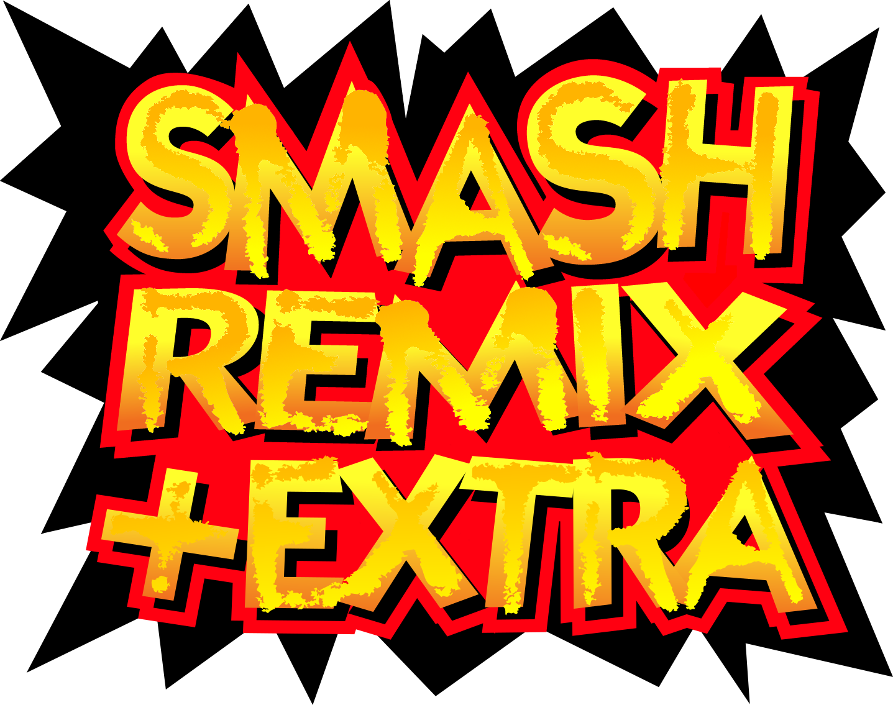

# Character Lab on Remix

An original-roster partial port of Character Lab features inside Smash
Remix +EXTRA: donor hitbox paths/timing, grabs/throws, all eleven neutral donors except Kirby copy, shared
retargeted poses, human/CPU preset assignments and return from Training to the editor.

- [Download ROM](https://github.com/lorenzosaraiva/smash-charbuilder/releases/download/remix-preview/remix-character-lab.z64)
- [Download play package](https://github.com/lorenzosaraiva/smash-charbuilder/releases/download/remix-preview/remix-character-lab.zip)
- [Play guide](character_creator_guide.md) | [Done / not done](docs/character-lab-status.md) | [Build guide](../docs/building.md)

**0.1.10 (2026-10-07):** planted Mario taunt growth, complete body Neutral B presets,
and no body fallback for unavailable aerial donor specials. See
[special edge-case verification and remaining acceptance](docs/special-edge-cases.md).
Donor tether grabs, paired throws, DK cargo carry/toss,
Kirby lift/fall/landing and customizable taunts now use shared source poses,
clocks and props. Mario grows/shrinks; Luigi keeps his damage and cancel window.
See [controls and verification](docs/paired-grabs-and-taunts.md).
Cutter sword/trails, Stone replacement, Falcon flames, blaster/tongue props
and Samus's charging orb remain available with owned cleanup.
All original neutral donors except Kirby copy use source
phases/poses, private projectile resources, charging/storage/release, Boomerang
return/catch and Egg Lay capture. Kirby copy remains excluded. See
[neutral controls and limits](docs/neutral-specials.md). Normals now use donor jab chains, buffering and rapid
phases; Link down-air bounce/rehit; Ness bat reflection; donor traction/air
physics; angle availability and aerial landing behavior. Shared animations and
source clocks remain independent of the body's rig. Neutral Special displays
fighter names, with its native option following the selected Body.
[Normal mechanics](docs/normal-mechanics.md) explains controls and remaining
rendered acceptance. [Animation coverage](docs/animations.md) tracks props/effects.
See the [full decomp-port matrix](docs/decomp-port.md) and
[checklist](docs/character-lab-status.md) for the still-missing mechanics,
rendered neutral/effect/taunt acceptance, paired alignment and stage interactions.

Open **Settings -> Character Lab** and keep **Original 12 Only** enabled. The
expanded roster stays playable, with its earlier experimental creator adapters;
full donor fidelity for those fighters remains pending. Old Remix settings and
recipes reset only on the initial preview migration; this neutral expansion
preserves existing Character Lab presets and all recipe bit widths. Rendered gameplay acceptance remains
pending even though the compiled runtime passes automated checks.

From the root on Windows/WSL, build and package with
`tools/build-remix-character-lab.ps1`. ROM/ZIP files appear in root `dist/`, with a
separate Desktop ROM copy. The original +EXTRA tools and documentation follow.

---

 

# Extra content build system
- **NOTE: This is not an official update to "Smash Remix" This is only a tool to add fan content to the game. The patches we provide are a community effort of new content all in one patch.**  
- If you would like to download our newest patch, please go here: [Latest Release](https://github.com/joaorb64/smashremix-plus-extra/releases)
  - After you have downloaded our patch, you can use [this patcher](https://kotcrab.github.io/xdelta-wasm/) to create the rom. 

# How To Play
- If you are on MOBILE, you need an emulator that will properly run ROMs over 64MB.  
For Android, best emulator would be [Mupen64Plus-AE NIGHTLY BUILD](https://github.com/mupen64plus-ae/mupen64plus-ae)
- For PC (Windows, Linux) it's recommended to use [RMG-K](https://github.com/Jay-Day/RMG-K/releases/latest) as this emulator supports online play AND rollback.

## Prerequisites For Building Your Own Build
- Windows: [Python 3.12+](https://www.python.org/downloads/latest/pymanager), pipenv
  - pipenv gets installed automatically by build.bat - to install manually, run `python -m pip install pipenv` in a terminal
- Linux: Python 3.12+, pipenv, wine

## Setting Up Your Own Build
- Clone the repository using `git clone --recursive` (note the recursive here for it to clone the original smashremix repo as a submodule)
  - If you cloned the repo non-recursively, run `git submodule update --init --recursive` in the clone directory to initialize and update the smashremix submodule
  - If you don't have Git or downloaded this repository without it (i.e. Code -> Download ZIP), download the [Smash Remix source](https://github.com/JSsixtyfour/smashremix/archive/refs/heads/master.zip) manually and extract it's files into `smashremix`
  - Clone into a local drive location and not somewhere like OneDrive to avoid potential issues
- Copy your legal vanilla SSB64 ROM into `smashremix/roms/` as `ssb.rom`. If you have a `.z64`, just rename the extension
- Set up the Python environment: In your clone directory, run `python -m pipenv install` (automatically handled by build.bat)

## Building
**To build, simply run:**
- **Windows: `build.bat`**
  - Manual build: `python -m pipenv run character_appender.py && patch_extra.bat`
- **Linux:**
  - `pipenv run python3 character_appender.py && wine patch_extra.bat`

The build consists of two parts:
- Running `character_appender.py` which does all the magic and generates a `smashremix/roms/original_extra.z64`. This is an extension of the `/roms/original.z64` file with extra content. It also prepares the `src/` and `build/` directories
- Running `patch_extra.bat` which builds the final ROM just like Remix.

## Modding Resources
- [Modding Wiki](https://joaorb64.github.io/smash64-modding-wiki/)
- [Moveset Editor](https://github.com/joaorb64/ssb64-moveset-file-editor)
- [Scripts](https://github.com/joaorb64/smashremix-plus-extra/tree/main/scripts) for extracting characters/stages from ROM, fixing normals from Blender, projectile creation, etc. are included with +EXTRA's source.
- [Templates](https://github.com/joaorb64/smashremix-plus-extra/tree/main/templates) for various assets are included with +EXTRA's source.  
- [In-game Character Creator](character_creator_guide.md) for creating, saving, and testing mixed movesets from the compiled roster.

## FAQ
- **"Where do I download this MOD?"**  
Head over to the 'Releases' section and download the latest version.  
- **"Is this a new Smash Remix update?"**  
This mod is NOT an official Smash Remix update, it builds off Remix, and adds cool stuff from the community!  
- **"What is the purpose of Smash Remix +EXTRA?"**  
We wanted to design a project that will allow users to add their own custom content on top of Smash Remix. We added content across the community into +EXTRA as an example, and even added new additions. Smash Remix +EXTRA is packaged with tools to assist and ease that process of importing your own work into the game.  
- **"Will this work on the original N64?"**  
Because the filesize is over 64MB, most flash carts will not run it. As long as your flashcart is compatible with larger rom sizes, it can work, but no guarantee.  
- **"I found a crash?"**  
Please create an issue on GitHub and we will try to fix it!  
- **"Can you add >Insert Character Here<"**  
No, but now YOU can! This mod is designed to help anybody bring in whatever character, stage, song & additional content they want into the game. We even have 3D Game & Watch!  
- **"How do I add something to this mod?"**  
You can download the source code of this mod and use the additional characters and stages as references!  
- **"Will there be future updates?"**  
We will focus on some bug fixes, polish, and pesky crashes, but the project is designed to encourage people to add their own content within the game.  
- **"Where can I go to ask more questions / for extra help?"**  
You can head over to the [Smash Remix Discord Server](https://discord.gg/ChpN332), we can help there.  
